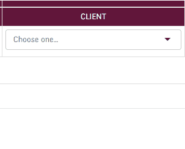
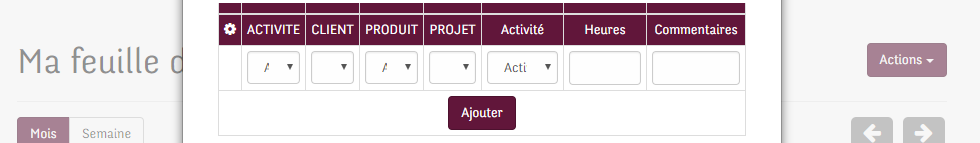
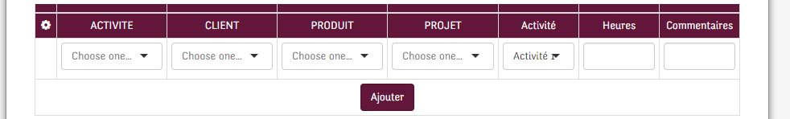
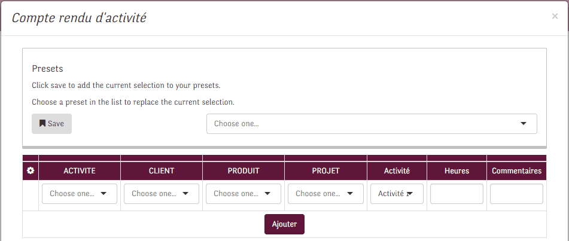

# opteamissed

A chrome extension to fix opteamis.com broken UX

## install

Clone the repo and follow instructions [here](https://developer.chrome.com/extensions/getstarted#unpacked)

## features

- replace selects by [selectize.js](https://selectize.github.io/selectize.js/)

  

- wider modal

  
  

- presets

  
